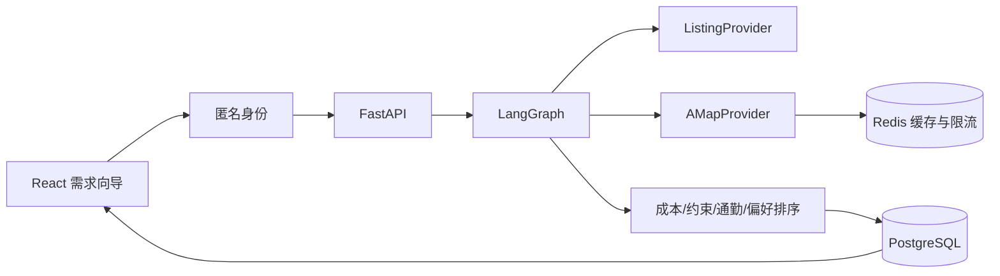

# RentWise AI

面向中国用户的智能租房决策 Agent。系统不是房源发布平台，而是在候选房源之上完成需求过滤、真实通勤、居住成本、多成员公平性和可解释排序。

> 当前房源来自模拟上海数据，不代表真实在租状态；通勤数据来自高德地图 Web 服务 API。

## 已实现

- 多步骤租房需求向导和中英文界面
- 最多四个家庭通勤目的地、权重与独立时间上限
- 高德公交、驾车、步行和骑行真实路线
- Redis 地理编码/路线缓存和共享 3 QPS 限速
- 真实月成本、首月支出、最差通勤、每周总通勤和公平性计算
- 确定性 LangGraph 决策状态图
- 硅基流动 Qwen 模型的开放偏好解析与证据约束解释
- LangGraph 强制调用的通勤规划 Skill
- 合同照片/PDF/TXT/Markdown OCR 与规则核验 Skill
- 匿名身份、偏好自动保存与恢复
- 收藏房源快照、搜索历史和推荐反馈
- PostgreSQL 持久化与 Agent 运行轨迹
- Docker Compose 一键运行

## 快速启动

复制环境变量并填入高德 Web 服务 Key：

```bash
cp .env.example .env
```

```env
MAP_PROVIDER=amap
AMAP_API_KEY=your_web_service_key
```

启动：

```bash
docker compose up -d --build
```

- Web: http://localhost:5173
- API: http://localhost:8000/docs
- Health: http://localhost:8000/api/health

### Real provider modes

- China demo: `LISTING_PROVIDER=mock`, `MAP_PROVIDER=amap`.
- US real-data verification: `LISTING_PROVIDER=rentcast`, `MAP_PROVIDER=google`, and a city such as `Austin, TX`.
- RentCast is protected by a Redis-backed monthly hard limit (`RENTCAST_MONTHLY_LIMIT`, capped at 50) and a 30-day query cache. Automated tests never call paid APIs.
- Google Routes responses are cached for 24 hours and requests are limited to 3 QPS by default.

## 运行链路



## 测试

```bash
docker compose exec backend pytest -q
cd frontend && npm run build
```

## 文档

- [系统架构](docs/architecture.md)
- [API 与匿名身份](docs/api.md)
- [评分规则](docs/scoring.md)
- [开发阶段与 LLM 接入边界](docs/development-plan.md)
- [合同核验 Skill](docs/contract-review.md)

## 当前边界

- 房源仍是模拟快照，原平台链接仅用于演示。
- LLM 只解释可验证证据；失败时自动保留规则模板结果。
- 自定义开放偏好只有与结构化标签精确匹配时才参与加分。
- 合同核验当前是首版规则集；已支持合同照片 OCR，普通房源图片分析尚未开始。
- 本系统提供决策辅助，不替代房源线下核验、律师意见或司法认定。

## 质量与生产能力

- PostgreSQL LangGraph 节点检查点和失败恢复。
- Alembic 数据库版本迁移。
- Playwright 浏览器端到端测试与 Agent 固定评估集。
- 匿名档案 JSON 导入导出；反馈会有限度影响后续排序。
- 房源图片证据受限分析；可选 MinIO 默认关闭且要求明确授权。
- 生产 Compose 覆盖、安全响应头、健康检查与数据库备份脚本。

## 最终交付文档

- [完整数据流与 Agent 状态图](docs/data-flow.md)
- [部署与运维](docs/deployment.md)
- [Agent 评估报告](docs/agent-evaluation.md)
