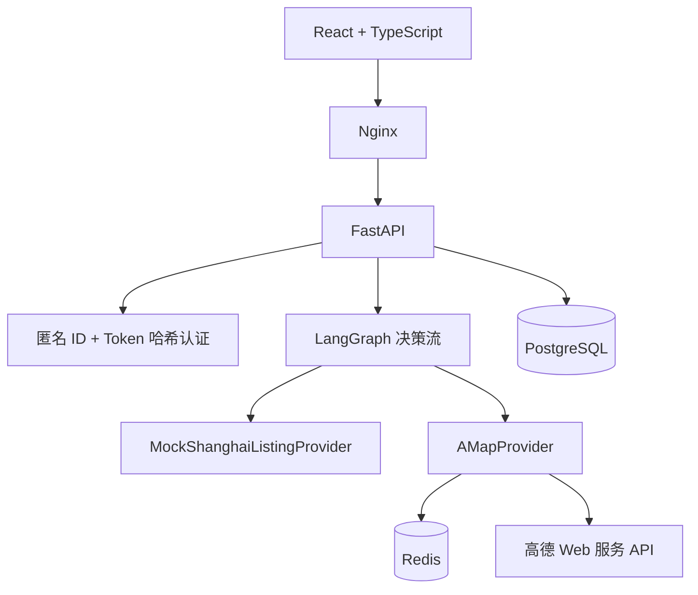
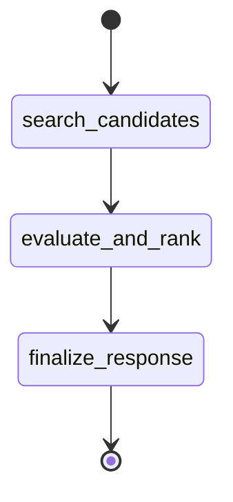

# 系统架构

## 组件

PostgreSQL 是匿名档案、收藏、历史、反馈和 Agent 运行记录的事实来源。Redis 只保存可丢弃的地图响应缓存和共享限速状态。

## LangGraph 状态图

- `search_candidates`：通过 ListingProvider 获取统一 Listing 模型。
- `evaluate_and_rank`：执行真实通勤、成本、硬约束、偏好和公平性计算。
- `finalize_response`：生成稳定的结构化响应和假设说明。

当前状态图完全确定性。LLM 将来只负责开放偏好理解和自然语言解释，不负责计算成本、通勤或法律结论。

## 数据表

- `anonymous_users`：匿名身份和 Token 哈希。
- `rental_profiles`：当前租房偏好 JSON 快照。
- `favorites`：收藏时房源快照。
- `search_history`：搜索输入和结果摘要。
- `recommendation_feedback`：用户显式反馈。
- `agent_runs`：LangGraph 运行状态、轨迹和摘要。

当前开发版本在启动时以 SQLAlchemy metadata 建表。进入生产部署前应切换到 Alembic 版本迁移。
